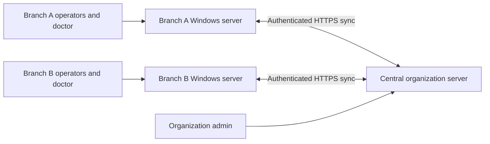

# Multi-clinic organization and outage operation

This development build supports branches of one organization, with one active
doctor login per clinic. Each branch runs its own server. The central server
collects records; it does not accept edits to a branch’s visits or money ledger.

## What each person can do

| Login | Access |
| --- | --- |
| Organization admin | Branches and letterheads, consolidated fee/age/diagnosis/referral totals, verified duplicate-patient linking. No other branches’ examination or report text. |
| Branch admin | Own branch users, services, templates, discounts, refunds and corrections; own branch operational reports. |
| Operator | Patient demographics, own branch bookings/tokens, payments and receipts. Other branches’ clinical history is hidden. |
| Doctor | Own branch examination, prescriptions and radiology reports; read-only finalized history from other branches of the same organization. |

Doctor prescriptions use the booking’s branch letterhead snapshot. Finalized
revisions require a reason and preserve earlier versions. Printing is restricted
to the doctor’s own clinic. Mark consultation services as **Doctor consultation /
OPD** in Services. Finalizing an examination completes consultation items;
imaging items still wait for their radiology reports.

## Normal operation and outages



Staff use their branch’s local address even when internet is available. The local
server and LAN must remain powered on. Internet loss does not interrupt local
registration, booking, tokens, payments, refunds or examinations. **Start Sync.bat**
retries every 30 seconds and sends saved changes when connectivity returns.
Other branches’ history is a cached copy, so it can be incomplete during an outage.
Doctor history screens show the last successful synchronization time.

Each source clinic owns its records. An acknowledged version cannot silently
replace a different version, rewrite a posted transaction, or remove a finalized
report. One server identity is bound to each clinic’s key. Never start a restored
backup as a second active server for the same clinic.

Search the synchronized patient directory before registering someone. **Use
existing patient** preserves the patient’s global identity across branches. If two
branches register the same person while offline, the organization admin can link
verified duplicate UUIDs with a reason. This links history without rewriting
old bookings, prescriptions or money entries. Similar names alone are never
merged automatically. A CNIC collision requires review.

## Simple testing on one computer

The normal standalone installation can demonstrate several clinics in one
database. Create an organization admin, add branches and configure branch staff
and services. This is a convenient demonstration; it does not simulate an outage.

From the clinic folder in Windows PowerShell:

```powershell
.\.venv\Scripts\python.exe manage.py create_organization_admin organization-admin
```

Choose your own password when prompted. Existing radiology records remain under
Sajjad Poly Clinic. New screens are **Clinics & letterheads**, **Organization
reports**, **Synchronization**, and the doctor’s **Examination & prescription**.
Screenshots are available in [the visual walkthrough](SCREENSHOTS.md).

## Installation for a technical helper

A central HTTPS host, persistent database and private storage are required for
online synchronization. These have not been deployed by this repository. For
multiple simultaneous staff, use PostgreSQL on the central host and branch hosts;
SQLite is only the verified development/test configuration. Review installation,
backup and printer behavior on the actual Windows machines before using real data.

### Central server

1. Install Python 3.12, the hash-pinned dependencies and PostgreSQL. Configure the
   existing `CLINIC_DB_*` variables, persistent storage and a TLS reverse proxy.
2. Set `CLINIC_NODE_MODE=central`, `CLINIC_ALLOWED_HOSTS` to the real host name,
   and `CLINIC_HTTPS=1`. Set `CLINIC_CSRF_TRUSTED_ORIGINS=https://your-host-name`.
   For a reverse proxy, set `CLINIC_PROXY_IP` to its exact IP and keep the
   application backend reachable only by that proxy. Render ingress is
   automatically configured. Do not expose the default development server publicly.
3. Run migrations, collect static assets and create the organization admin.
4. Sign in, configure clinic names, codes and letterheads. Download each branch’s
   configuration from **Clinics & letterheads**.
5. Issue a separate private key for each clinic on the central host:

   ```powershell
   .\.venv\Scripts\python.exe manage.py issue_sync_key SPC --output .runtime\SPC-key.private
   ```

   Transfer the configuration and key securely to that branch. Never place keys
   in Git, email/chat messages, screenshots or public folders. Reissuing a key
   rotates it while preserving the bound server identity.

### Each fresh Windows branch server

Configure the branch **before creating users or patient records**. Do not run the
single-clinic Setup Clinic.bat first: it creates an admin before branch binding.
Use a separate fresh application folder for each branch. In PowerShell:

```powershell
py -3.12 -m venv .venv
.\.venv\Scripts\python.exe -m pip install --require-hashes -r requirements.txt
.\.venv\Scripts\python.exe manage.py migrate --noinput
.\.venv\Scripts\python.exe manage.py configure_branch "C:\Private\SPC-configuration.json" --lan-ip 192.168.1.20
.\.venv\Scripts\python.exe manage.py createsuperuser
.\.venv\Scripts\python.exe manage.py collectstatic --noinput
```

Replace the example address with the server’s reserved private LAN IP. The branch
configuration persists in `.runtime/node.json`. Start Clinic.bat opens the local
portal. Other computers use that server’s address on port 8000. Restrict Windows
Firewall access to the clinic LAN and use a trusted local HTTPS setup for real
patient data. The database port should not be exposed to operator computers.

Sign in as branch admin and add the doctor and operators, consultation/imaging
services with real prices, diagnoses and templates. Accounts are managed locally;
user accounts and passwords are not synchronized from the central host.
Organization letterheads are maintained centrally and refreshed on sync.

Run **Configure Sync.bat**, enter the central HTTPS address and the path to the
private key file, then run **Start Sync.bat**. Keep both application and sync
windows running. A technical helper can schedule them at Windows startup.
Protect `.runtime` and database/backup folders with Windows file permissions;
only the trusted server administrator should have direct filesystem access.

### Backups and recovery

Back up each source branch and the central server. An entire server backup may
contain cached clinical history from other branches. The portal disables full
backup downloads through clinic logins when shared data exists; the trusted host
administrator uses Backup Clinic.bat or the backup command instead. Protect the
external drive. See [backup and restore instructions](BACKUPS.md).

A restored older database or a second machine for the same source clinic can
produce a synchronization conflict. Stop its worker, preserve both databases,
and reconcile with a technical helper. Do not delete outbox rows, change the
server identity, reset the central cursor or force overwrite histories to make
an error disappear. Central database rollback likewise requires reviewed recovery.

## Verification and remaining deployment checks

The Django tests cover branch/org isolation, doctor-only history, prescription
revisions and immutable snapshots, token sequences, sync authorization,
idempotency, source binding, offline queues and identity reconciliation.

`scripts/verify_branch_sync.py` creates three independent temporary installations,
uses real HTTP requests, disconnects the central server, books a visit and records
a refund/revision offline, reconnects and verifies both histories and net fees.
It uses invented data and deletes its temporary installations by default:

```powershell
.\.venv\Scripts\python.exe scripts\verify_branch_sync.py
```

PostgreSQL concurrency, physical Windows restarts/LAN/TLS, actual 80 mm/A4 printing,
a scheduled daily external-drive backup and host-level restore still need testing.
No public interactive demo, medicine dispensing or doctor revenue shares are
included. Financial totals use posting dates in Pakistan time; visit statistics
use booking dates. Central totals reflect the most recently received branch data.
